# Fiscal Analysis of EU Countries

### Contents

1. [Long-term trends of deficit/surplus](#long-term-trends)

2. [Comparison of fiscal performance among countries using GDP](#comparison-using-gdp)

3. [Correlation between deficit/surplus and GDP growth rates](#correlation-between-deficitsurplus-and-gdp-growth-rate)

4. [Clustering countries using various features and methods](#clustering-countries-based-on-deficitsurplus-gdp-inflation-rate-unemployment-rate)

4. [Notes](#notes)

## Long term trends of deficit/surplus

For background: *Deficit/Surplus = Government Revenue - Government Expenditure* 

- For units of measure, the dataset offers million euro, million units of national currency, and percentage of GDP, and I chose million euro, so that results were easily comparable.

Therefore, when looking at deficit/surplus, a positive value implies that the government is doing well, while negative doesn't.

The dataset used for this part was: [Government deficit/surplus, debt, and associated data](https://ec.europa.eu/eurostat/databrowser/view/gov_10dd_edpt1__custom_10088085/default/table?lang=en)

**Comparing standard deviation of deficit/surplus among EU countries:**

Standard deviation for each country was calculated as the standard deviation over all observed values of deficit/surplus in million euros from 2014 to 2022.

High standard deviation suggests that the deficit/surplus values fluctuate widely around the mean. It also suggests greater uncertainty, risk, and unpredictability with the financial situation of the country. 

On the other hand, low standard deviation suggests less variability, indicates stability, and predictability in the fiscal environment. 

Observations:

- Germany, Italy, and France have much higher standard deviations than the other countries. 

    - These countries have some of the largest economies in the EU which also means that they are some of the most complex. This, in turn, might mean that they are some of the most sensitive which might be one of the reasons for more volatility in government finances.

    - Germany tends to have a more conservative approach to government spending, but the migrant crisis and COVID pandemic caused them to greatly increase spending.

    - France and Italy have historically had higher levels of public debt and often used government money to combat a stagnant economy, which might be one of the causes of fluctuation.

- Slovenia, Bulgaria, Slovakia, Croatia, Luxembourg, Lithuania, Latvia, Cyprus, Malta, and Estonia all seem to have a more stable economy

    - All of these countries have smaller, more contained economies than other countries in the EU which could result in less volatility in revenue and expenditure.

    - Smaller EU countreis also often benefit from EU funds that are aimed at promoting structural development. These can provide a stable source of economic support and can reduce the need for drastic changes in fiscal policies.

**Comparing mean of deficit/surplus among EU countries:**

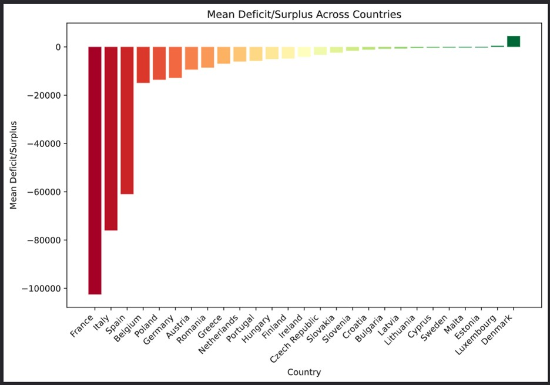

For the same values as standard deviation, the mean deficit/surplus was calculated for each country.

Countries with more robust and resilient economies tend to report a mean deficit/surplus greater than zero, reflecting a surplus in their fiscal balances, whereas nations with a negative mean often face economic challenges that may indicate a deficit, potentially stemming from factors such as increased government spending, lower tax revenues, or broader macroeconomic issues.

Observations:

- Countries with a really low mean are France, Italy, and Spain

    - France, Italy, and Spain are known to have relatively high public debt levels compaired to other EU countries.

- Countries with a mean that's definitely above zero are Denmark and Louxembourg

    - Both countries use strong economic managment to carefully monitor and plan use of public finances which often results in overall surpluses.

    - Denmark and Luxembourg also have high taxes which contributes signigicantly to government income.

- Countries with a mean close to zero are Lithuania, Cyprus, Sweden, Malta, and Estonia

    - Sweden has a diverse economy which brings in money from industrial, technology, and service sectors, contributing to stable revenue streams.

    - Estonia's performance can partially be accounted for by its tech-driven economy.

    - Malta, Lithuania, and Cyprus have all recently grown their economy through focus on tourism and financial services.

**Combining mean and standard deviation of deficit/surplus to rank EU countries:**

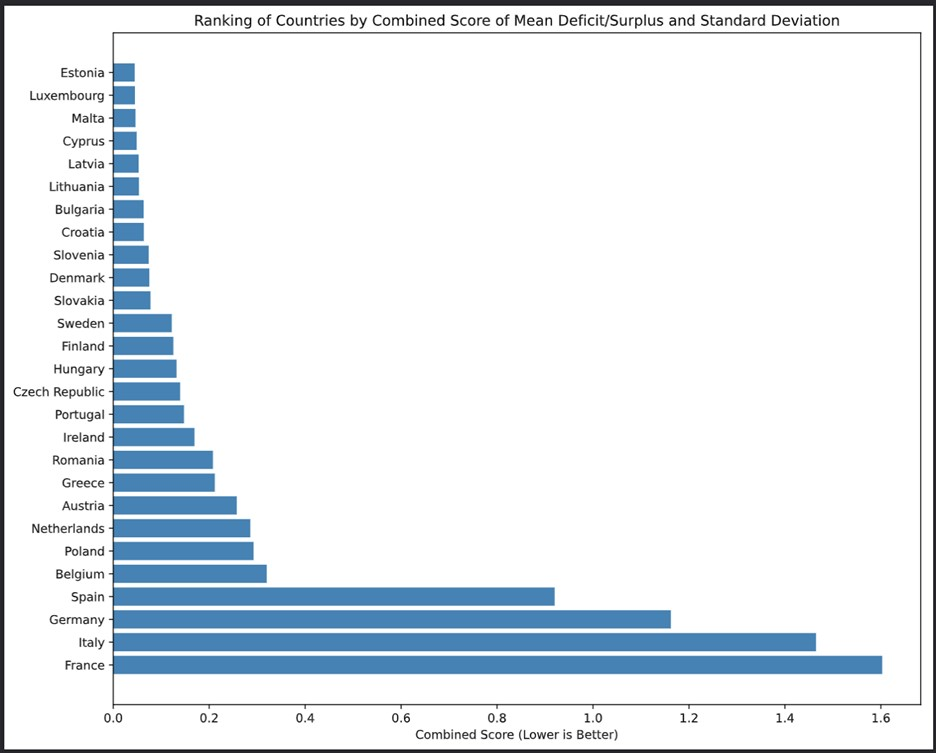

I wanted to find a combined ranking of the countries using both standard deviation and mean of deficit/surplus, so I came up with a simple ranking that penalized high standard deviation, praised low standard deviaiton, penalized low mean, and praised high mean. This gave each country a score in a rough range of [0,2], where the lower, the better, indicating more stable, positive finances.

Calculating combined ranking:

- Normalize mean and standard deviation

- Score = (1 - normalized mean) + normalized mean

Therefore, lower scores are better.

Top 5 (from the top):

1. Estonia

2. Luxembourg

3. Malta

4. Cyprus

5. Latvia

Bottom 5 (from the bottom):

1. France

2. Italy

3. Germany

4. Spain

5. Belgium

**Using linear regression to identify countries with increasing/decreasing deficit/surplus:**

Using the linear regression function from the SciPy Stats package, an analysis was done on the financial data for each country, categorizing them based on whether their deficit/surplus is increasing (positive slope) or decreasing (negative slope). It’s important to look at the R-squared value from these calculations. A slope might seem significant, but a low R-squared value suggests the linear model might not fit the data well. This means the slope, by itself, might not fully explain the trend.

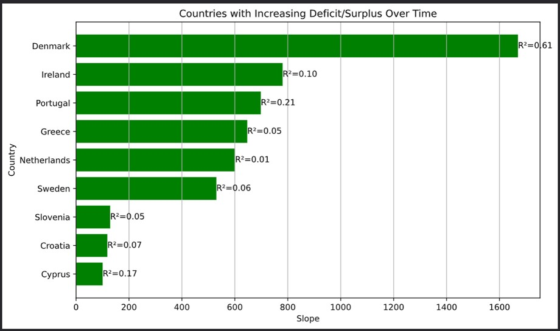

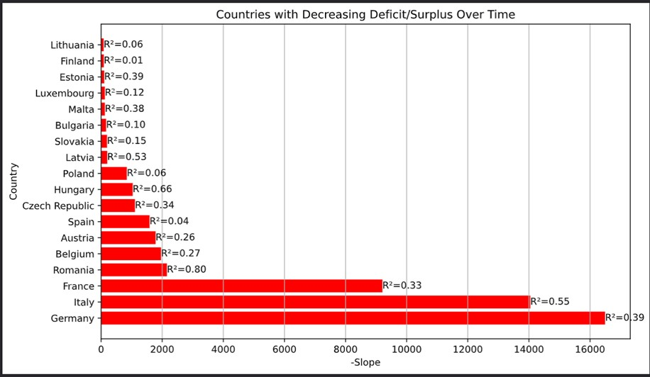

From the R-squared values it's quite obvious that none of countries' data follows a linear trend, therefore, this analysis doesn't really tell us much about fiscal trends in EU countries, except that they have a more complex relationship than a simple linear one.

## Comparison using GDP

Countries are ranked based on average deficit/surplus as a percentage of GDP

Datasets used were [Government deficit/surplus, debt, and associated data](https://ec.europa.eu/eurostat/databrowser/view/gov_10dd_edpt1__custom_10088085/default/table?lang=en) and [Gross domestic product at market prices](https://ec.europa.eu/eurostat/databrowser/view/tec00001/default/table?lang=en&category=t_na10.t_nama10.t_nama_10_ma)

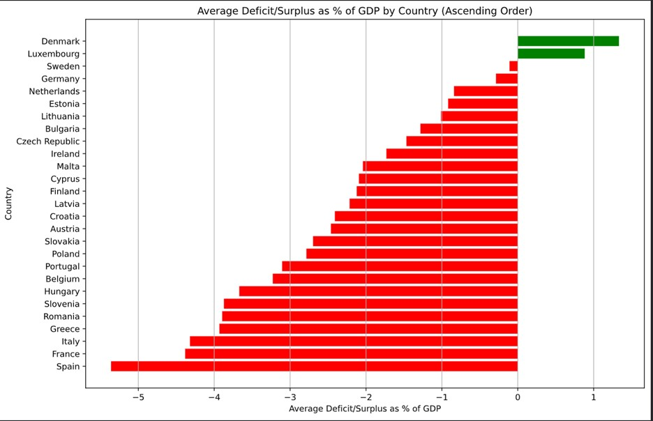

- The calculation for this is done by calculating the deficit/surplus as a percentage of GDP for each year for each country:

    *Deficit/Surplus / GDP per capita*

    - Both Deficit/Surplus and GDP per capita are measured in millions of euros

- Then the average is taken over all of the years (2012-2022)

From the graph, one can easily observe that the only countries with a positive average are Denmark and Luxembourg while the remaining countries have negative averages. Spain, France, and Italy have the worst averages.

This is a similar result to the one observed when looking at standard deviation and mean of deficit/surplus of EU countries.

## Correlation between deficit/surplus and GDP growth rate

- Datasets used were [Government deficit/surplus, debt, and associated data](https://ec.europa.eu/eurostat/databrowser/view/gov_10dd_edpt1__custom_10088085/default/table?lang=en) and [Real GDP growth rate - volume](https://ec.europa.eu/eurostat/databrowser/view/tec00115/default/table?lang=en&category=t_na10.t_nama10.t_nama_10_ma)

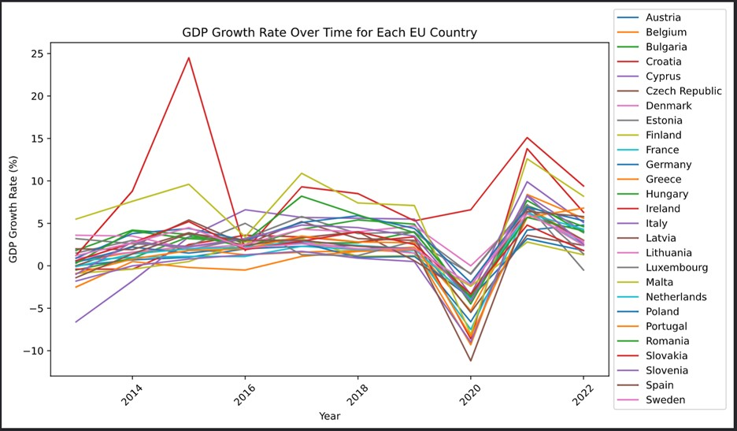

We can use the above graph to make the following conclusions about GDP growth rate over time for each EU country:

- Synchronous movement

    - There is a notable synchrony in the GDP growth rates of most countries, particularly evident during the pandemic when all experienced a downturn, often entering negative growth. This uniform pattern suggests a shared economic impact, characteristic of a recessionary period across the EU.

- Variability in growth rates

    - Despite the general synchronicity, the extent of growth rate changes varies significantly by country. For instance, Ireland's growth rate in 2015 shows a remarkable spike, and it continues to display a distinct trend compared to others even in subsequent years.

- Recovery post 2020

    - After the pandemic-induced contraction, all countries show a strong recovery in GDP growth rates. This rebound suggests a period of economic recovery, although the speed and magnitude of this recovery vary among the EU member states.

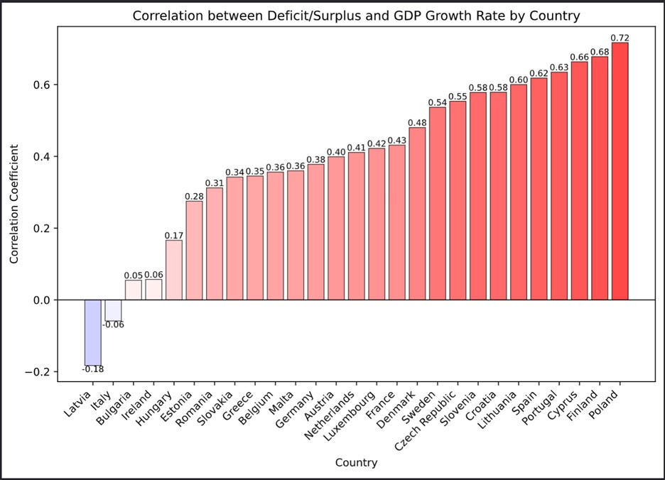

Observations for correlation between GDP grown rate and deficit/surplus:

- Diverse correlation values

    - Correlation coefficients vary significantly across countries which suggests that the relationship between government fiscal balance (deficit/surplus) and GDP growth is not uniform across the EU.

- Mostly positive correlations

    - The majority of countries have a positive correlation coefficient, indicating, that, in general, a higher deficit/surplus is associated with higher GDP growth in those countries.

- Strongest and weakest correlations

    - Poland has the strongest positive correlation, which implies a more pronounced relationship between fiscal balance and economic growth. A correlation coefficient of 0.71 implies strong correlation.

    - Latvia shows a negative correlation, suggesting that GDP growth might move in the opposite direction to fiscal balance changes. Although Latvia has the lowest correlation coefficient of -0.18, it isn't actually that low and only implies moderate correlation.

## Clustering countries based on deficit/surplus, gdp, inflation rate, unemployment rate

Datasets used were: [Government deficit/surplus, debt, and associated data](https://ec.europa.eu/eurostat/databrowser/view/gov_10dd_edpt1__custom_10088085/default/table?lang=en)
, [Gross domestic product at market prices](https://ec.europa.eu/eurostat/databrowser/view/tec00001/default/table?lang=en&category=t_na10.t_nama10.t_nama_10_ma), [HICP - inflation rate](https://ec.europa.eu/eurostat/databrowser/view/tec00118/default/table?lang=en), and [Total unemployment rate](https://ec.europa.eu/eurostat/databrowser/view/tps00203/default/table?lang=en)

**Clustering methods**

1. The first method calculated mean, standard deviation, min, and max were calculated for each feature and used for clustering.

    - Example: 
    Country_A has observed values [2, 3, 5, 6] for gdp for years [2012, 2013, 2014, 2015] respectively. This would turn into column, value pairs gdp_mean=4, gdp_stddev=1.83, gdp_min=2, gdp_max=6. 

2. The second method expanded all instances of values for a specific features and used all of them as features for clustering.

    - Example:
    Country_A with the same observed values as above would turn into column, value pairs gdp_2012=2, gdp_2013=3, gdp_2014=5, gdp_2015=6

- Both methods then used *KMeans* from *sklearn.cluster* 

**Number of clusters**

- I implemented a method which uses the Elbow Method and Silhouette Method to help visualize which number of clusters to choose. 

    - The Elbow Method determines the optimal number of clusters by identifying the point where adding more clusters yields diminishing returns in terms of reducing the within-cluster sum of squares (WCSS).

    - The Silhouette Method assesses the optimal number of clusters by measuring how similar each data point is to its own cluster compared to other clusters, aiming for the highest average silhouette score.

    - Method 1 visualization:

    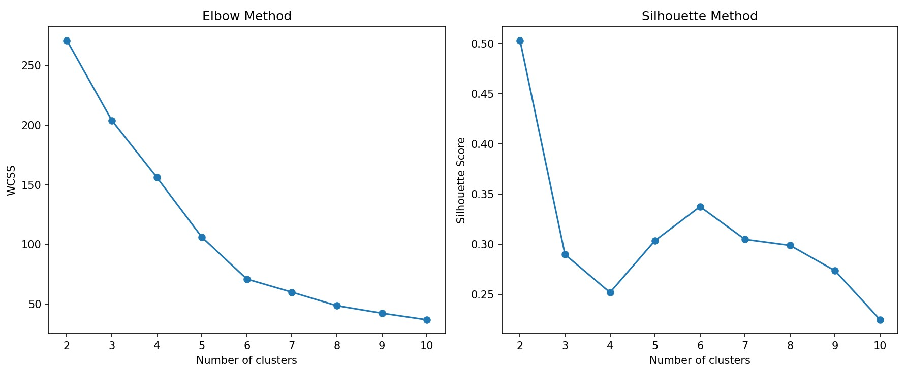

    - Method 2 visualization:

    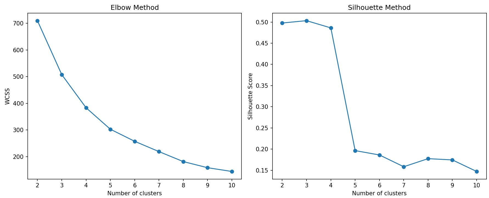

    - Choosing number of clusters from the graphs:

        - For the Elbow Method, one should choose the number of clusters at the point where the graph's line angle changes most abruptly, resembling an elbow. For the Silhouette Method, one should select the number of clusters that corresponds to the highest silhouette score, indicating optimal separation and cohesion.

        - I tried to balance results of both graphs when choosing number of clusters and deduced that the best number of clusters for method 1 is 6 and for method 2 is 3.

**Results and visualization**

Results from both methods:

    CLUSTERS FROM METHOD 1:

    Cluster 0:
    Czech Republic, Estonia, Hungary, Lithuania, Latvia, Poland, Romania

    Cluster 1:
    France, Italy

    Cluster 2:
    Bulgaria, Cyprus, Croatia, Ireland, Portugal, Slovenia, Slovakia

    Cluster 3:
    Germany

    Cluster 4:
    Austria, Belgium, Denmark, Finland, Luxembourg, Malta, Netherlands, Sweden

    Cluster 5:
    Greece, Spain

    CLUSTERS FROM METHOD 2:

    Cluster 0:
    Germany

    Cluster 1:
    Austria, Belgium, Bulgaria, Cyprus, Czech Republic, Denmark, Estonia, Finland, Croatia, Hungary, Ireland, Lithuania, Luxembourg, Latvia, Malta, Netherlands, Poland, Portugal, Romania, Sweden, Slovenia, Slovakia

    Cluster 2:
    Greece, Spain, France

Visualization:

- PCA was used to lower dimensionality of the data to be able to plot it easier. 

    - Principal Component Analysis (PCA) reduces the dimensionality of data by transforming it into a new set of variables, the principal components, which are ordered by the amount of variance they capture.

- Clusters created using method 1:

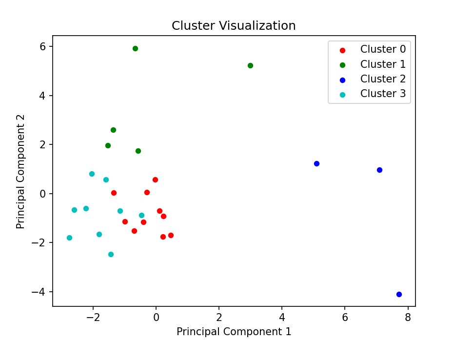

- Clusters created using method 2:

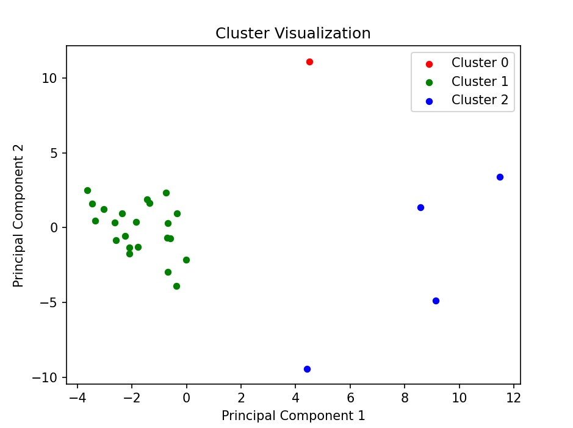

*NOTE*: A few countries aren't included because the datasets had incomplete data for them.

## Notes

- The main objective of this project is to conduct a thorough analysis of government finances across EU countries, with a focus on addressing specific inquiries.

- Within the /code directory, each Python file corresponds to a distinct section within this document and addresses a particular question pertaining to fiscal analysis.

- The project extensively utilizes technologies such as NumPy, Pandas, and Matplotlib.

- All datasets utilized in this analysis are sourced from [Eurostat](https://ec.europa.eu/eurostat/web/main/data/database)

