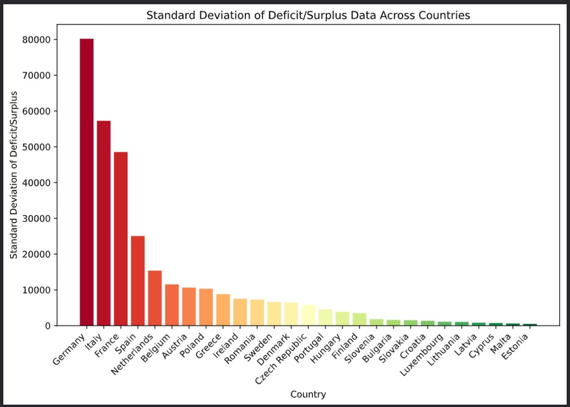

# Fiscal Analysis of EU Countries

### Contents

1. [Long-term trends of deficit/surplus](#long-term-trends)

2. [Comparison of fiscal performance among countries using GDP](#comparison-using-gdp)

3. [Correlation between deficit/surplus and GDP growth rates](#correlation-between-deficitsurplus-and-gdp-growth-rate)

4. [Notes](#notes)

## Long term trends

What are long-term trends in government deficit/surplus for EU countries?

- For background: *Deficit/Surplus = Government Revenue - Government Expenditure*

    - So, when looking at deficit/surplus, it's good to have a positive observed value rather than a negative one

- The dataset used was [Government deficit/surplus, debt, and associated data" from Eurostat](https://ec.europa.eu/eurostat/databrowser/view/gov_10dd_edpt1__custom_10088085/default/table?lang=en)

**Visualization of the dataset:**

Observations:

- Most countries tend to have a deficit/surplus close to zero

- In 2020, a lot of EU countries had much worse deficit/surplus than in other years and most of them seem to be improving since then, but the rate of improvement seems to be varied

**Comparing standard deviation of deficit/surplus among EU countries:**

High standard deviation suggests that the deficit/surplus values fluctuate widely around the mean. It also suggests greater uncertainty, risk, and unpredictability with the financial situation of the country. 

On the other hand, low standard deviation suggests less variability, indicates stability, and predictability in the fiscal environment. 

Observations:

- Germany, Italy, and France have higher much higher standard deviations than the other countries. 

- Slovenia, Bulgaria, Slovakia, Croatia, Luxembourg, Lithuania, Latvia, Cyprus, Malta, and Estonia all seem to have a more stable economy

**Comparing mean of deficit/surplus among EU countries:**

Countries with more robust and resilient economies tend to report a mean deficit/surplus greater than zero, reflecting a surplus in their fiscal balances, whereas nations with a negative mean often face economic challenges that may indicate a deficit, potentially stemming from factors such as increased government spending, lower tax revenues, or broader macroeconomic issues.

Observations:

- Countries with a really low mean are France, Italy, and Spain

- Countries with a mean that's definitely above zero are Denmark and Louxembourg

- Countries with a mean close to zero are Lithuania, Cyprus, Sweden, Malta, and Estonia

**Combining mean and standard deviation of deficit/surplus to rank EU countries:**

Scoring was done in a way that benifited countries with high means and low standard deviations. Therefore, countries with a lower score are better, rank-wise.

Top 5 (from the top):

1. Estonia

2. Luxembourg

3. Malta

4. Cyprus

5. Latvia

Bottom 5 (from the bottom):

1. France

2. Italy

3. Germany

4. Spain

5. Belgium

**Using linear regression to identify countries with increasing/decreasing deficit/surplus:**

Using the linear regression function from the SciPy Stats package, an analysis was done on the financial data for each country, categorizing them based on whether their deficit/surplus is increasing (positive slope) or decreasing (negative slope). It’s important to look at the R-squared value from these calculations. A slope might seem significant, but a low R-squared value suggests the linear model might not fit the data well. This means the slope, by itself, might not fully explain the trend.

## Comparison using GDP

How do fiscal performances among EU countries?

- To measure this countries are ranked based on average deficit/surplus as a percentage of GDP

- The calculation for this is done by calculating the deficit/surplus as a percentage of GDP for each year for each country:

    *Deficit/Surplus / GDP per capita*

    - Both Deficit/Surplus and GDP per capita are measured in millions of euros

- Then the average is taken over all of the years (2012-2022)

From the graph, one can easily observe that the only countries with a positive average are Denmark and Luxembourg while the remaining countries have negative averages. Spain, France, and Italy have the worst averages.

## Correlation between deficit/surplus and GDP growth rate

From this graph alone, one can come to the following conclusions:

- Synchronous movement

    - There is a notable synchrony in the GDP growth rates of most countries, particularly evident during the pandemic when all experienced a downturn, often entering negative growth. This uniform pattern suggests a shared economic impact, characteristic of a recessionary period across the EU.

- Variability in growth rates

    - Despite the general synchronicity, the extent of growth rate changes varies significantly by country. For instance, Ireland's growth rate in 2015 shows a remarkable spike, and it continues to display a distinct trend compared to others even in subsequent years.

- Recovery post 2020

    - After the pandemic-induced contraction, all countries show a strong recovery in GDP growth rates. This rebound suggests a period of economic recovery, although the speed and magnitude of this recovery vary among the EU member states.

Observations:

- Diverse correlation values

    - Correlation coefficients vary significantly across countries which suggests that the relationship between government fiscal balance (deficit/surplus) and GDP growth is not uniform across the EU.

- Mostly positive correlations

    - The majority of countries have a positive correlation coefficient, indicating, that, in general, a higher deficit/surplus is associated with higher GDP growth in those countries.

- Strongest and weakest correlations

    - Poland has the strongest positive correlation, which implies a more pronounced relationship between fiscal balance and economic growth.

    - Latvia shows a negative correlation, suggesting that GDP growth might move in the opposite direction to fiscal balance changes.

## Notes

- The main objective of this project is to conduct a thorough analysis of government finances across EU countries, with a focus on addressing specific inquiries.

- Within the /code directory, each Python file corresponds to a distinct section within this document and addresses a particular question pertaining to fiscal analysis.

- The project extensively utilizes technologies such as NumPy, Pandas, and Matplotlib.

- All datasets utilized in this analysis are sourced from [Eurostat](https://ec.europa.eu/eurostat/web/main/data/database)

